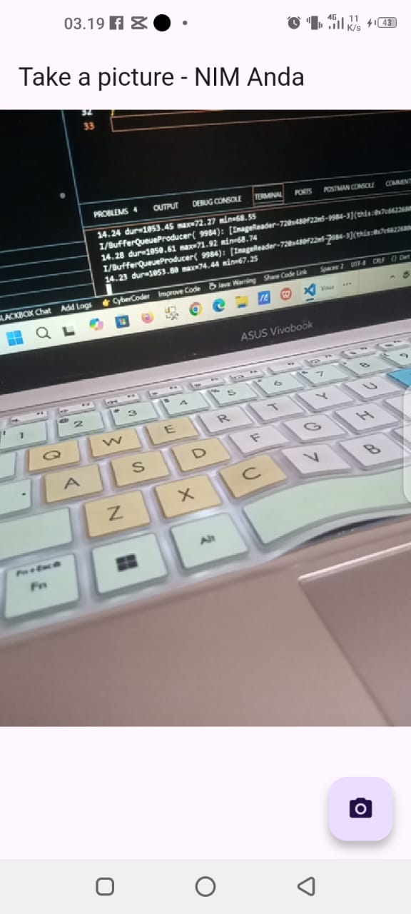
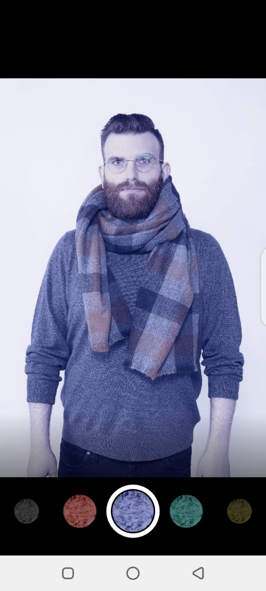
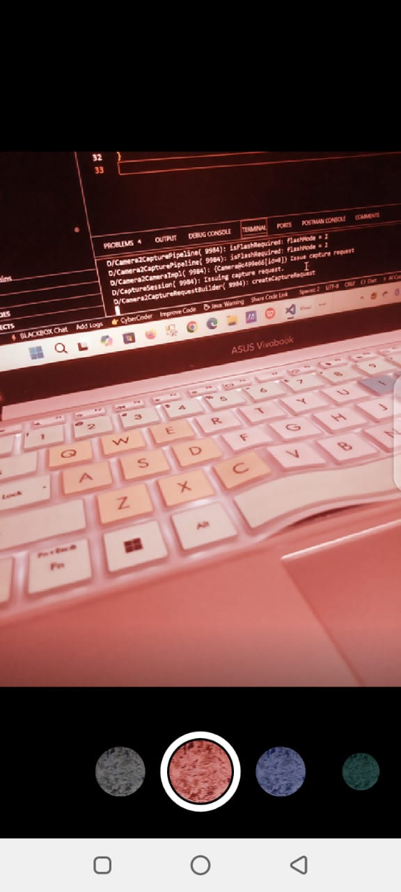

Praktikum 1

Berikut adalah hasil jadi dari praktikum 1 dimana kami diminta untuk membuat aplikasi yang dapat menampilkan kamera, serta mengambil gambar dengan kamera tersebut di device handphone.

Praktikum 2

 

Berikut adalah hasil jadi dari praktikum 2 dimana kami diminta untuk membuat aplikasi dimana gambar dapat diberikan efek filter warna sederhana.

Hasil Gabungan Praktikum 1 & 2

Berikut adalah hasil akhir apabila kedua fitur aplikasi sebelumnya digabungkan, menghasilkan sebuah aplikasi yang dapat mengambil gambar serta menerapkan filter sederhana pada gambar yang telah di foto.